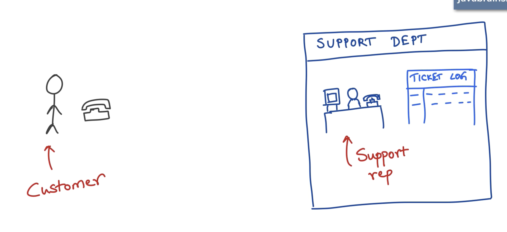
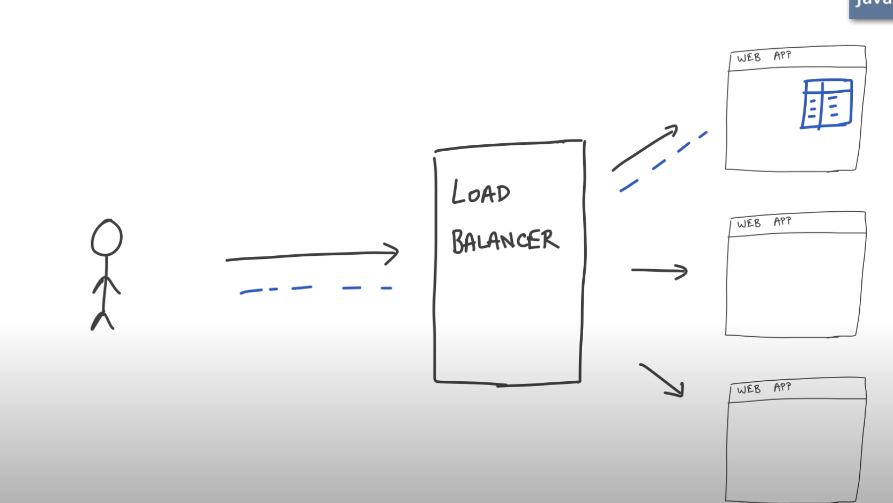
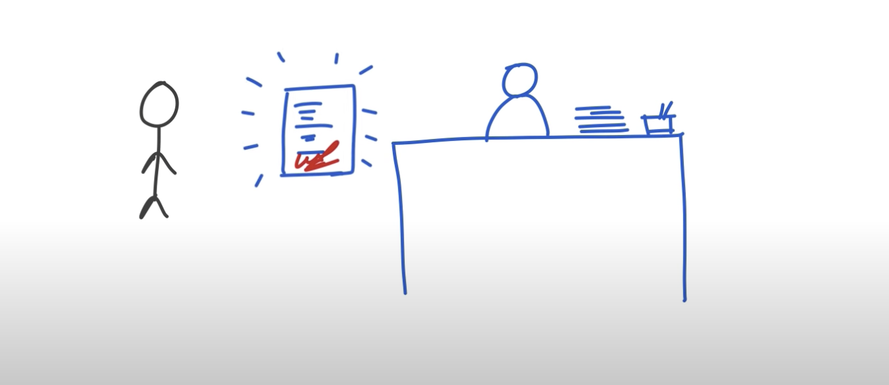
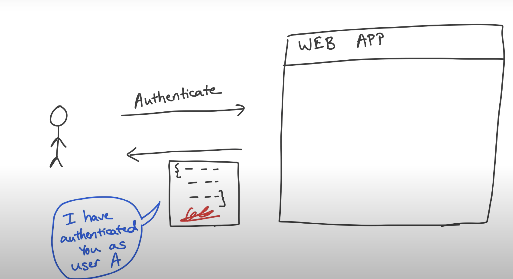
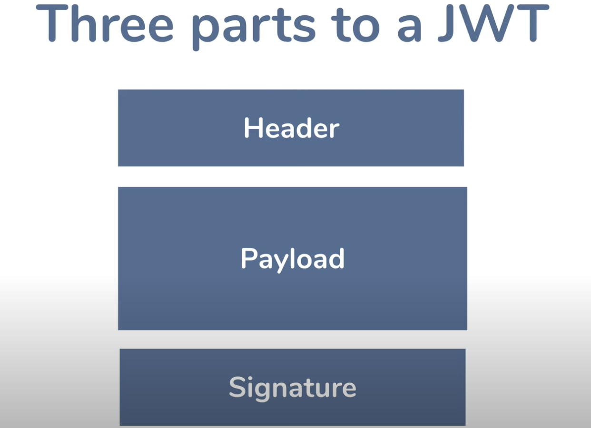
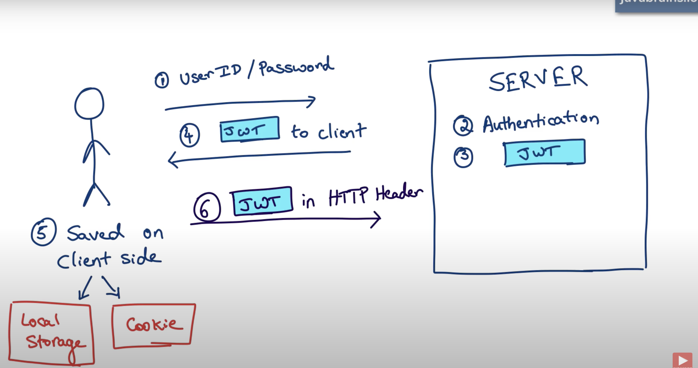
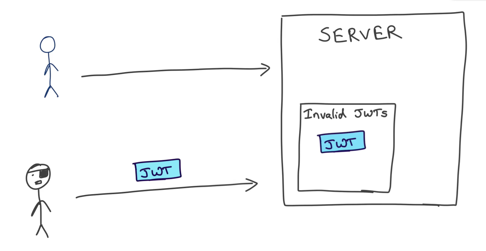

 Authentication means login & password verfication, once user to authenticated
 for sebsequent request, we shouldn't ask his credentials again. So thats
 where authorization come into picture.

# Authorization Types
 1) Session Token
 2) JWT (JSON Web Token)

# Session token

- support if a customer calls to customer case an raises a compalint, 
    support persons notes all his issues and gives him ticket number
    so for further followups, he no need to share the details again.
- Next time when he calls again he just provides ticket num and the
    customer rep will check his dettails using that ticket and
    responds
- This ticket number is session token like

- once user login/Authenticated, servers creates and provides a session ID

-- client receives this session id and stores in cookie and send this sessionid
in header for further calls.

## Problems with this approach

- this approach works fine with single server.
- In the modern LB and multiple servers, in that case only one server
contains session details, if req goes to another server, it can't recognize it.

solution::

use a common Redis DB that contains session Info and every time when req
goes to server, server makes additional call to DB to check the session details

to solve above issue, LB uses sticky session approach, where LB remembers the 
servers details and route the all calls related to that server, points to the same server

# JWT

Insted of generating online id, write all info in a paper and give to customer
and ask him to bring back that paper next time.
what if he modifes the info, sing that document, so that we can assume it is
trusted doc

so in this process, when user is authenticated, server gives him the JSON web token

## jwt format
https://jwt.io/

JWT has 3 parts separated by dot. 
1) Header
2) Payload
3) signature

Base64 decoder

https://cryptii.com/

JWT is passed in header in the format
Authorization: Bearer JWT

    - JWT can't be tampered, but what if someone stoles complete JWT and uses for another user ?

- always use https only

Another disadvantage is no expiration for JWT like sessionID

    so server has to maitain blacklisted JWTs